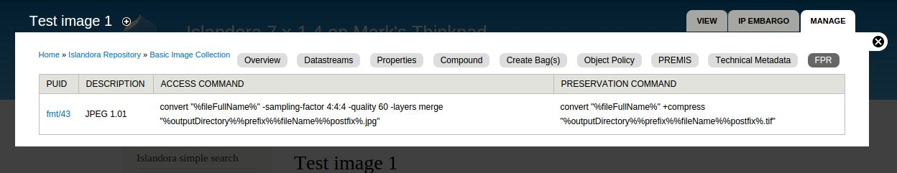

# Islandora FPR

## Overview

This module retrieves and displays selected [Archivematica Format Policy Registry](https://ww.archivematica.org/en/docs/archivematica-1.3/user-manual/preservation/preservation-planning/#fpr) (FPR) entries corresponding to a [PRONOM PUID](http://en.wikipedia.org/wiki/PRONOM), which the module parses from the FITS datastream accompanying an Islandora object, if that datastream is available.

The module is a proof of concept to retrieve the FPR entries for commands that create access and preservation derivatives from an object's OBJ datastream. The module also adds a datastream for each of the commands, to illustrate one possible method for storing the commands for use by modules that create derivatives.

An accompanying sample module, Islandora FPR Image, creates a derivative from a JPEG OBJ file with DSID 'FPR_IMAGE_TEST_DS' by running the access command defined for JPEGs in the FPR.

## Dependencies

[Islandora FITS](https://github.com/Islandora/islandora_fits)

## Configuration

To configure the URL of the Archivematica FPR endpoint and the HTTP timeout value, visit admin/islandora/tools/fpr.

## Usage

This module inserts an "FPR" subtab into each object's "Manage" tab if the object has a FITS datastream. Clicking on this tab reveals information retrieved from the FPR (and also triggers the code that adds the datastreams).

If the command datastreams exist, they are replaced by the latest content retrieved from the FPR.

## Maintainer

* [Mark Jordan](https://github.com/mjordan)

